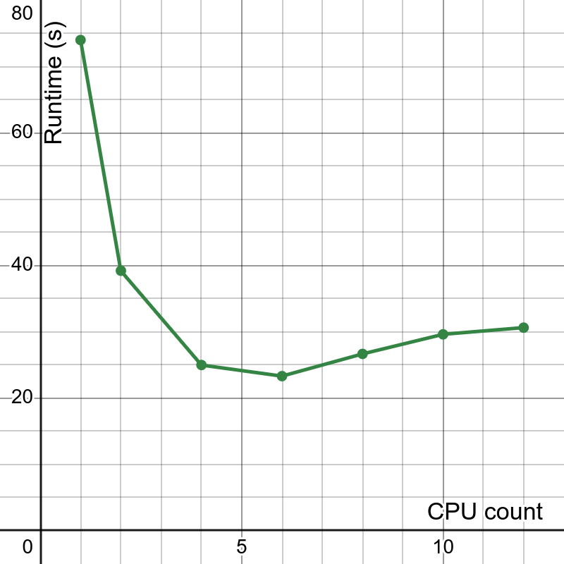

# Parallelized Nodal Exchange EOD Futures Parser

## Requirements
`tabula-py` requires:
* Python >= 3.9
* Java >= 8

```sh
$ python3 --version
Python 3.13.3
$ java --version
openjdk 24.0.1 2025-04-15
```

## Usage
Create virtual environment and install Python dependencies:
```sh
$ python3 -m venv env
$ source env/bin/activate
$ pip3 install -r requirements.txt
```

Run:
```sh
# defaults
$ python3 main.py

# silence tabula warnings to stderr
$ python3 main.py 2>warn.log

# with options
$ python3 main.py --num-cores 12 --pdf-name "EOD_FUTURES_REPORT.PDF" --split-dir "split"
```

## Runtimes


Runtimes on a 12-core PC.

## Extensions
* Currently `num-cores == num-splits`, experiment with `num-cores != num-splits`.
